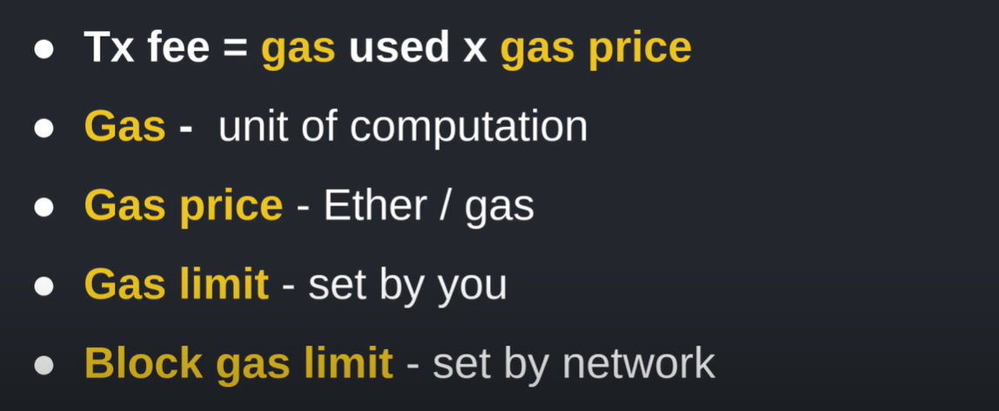
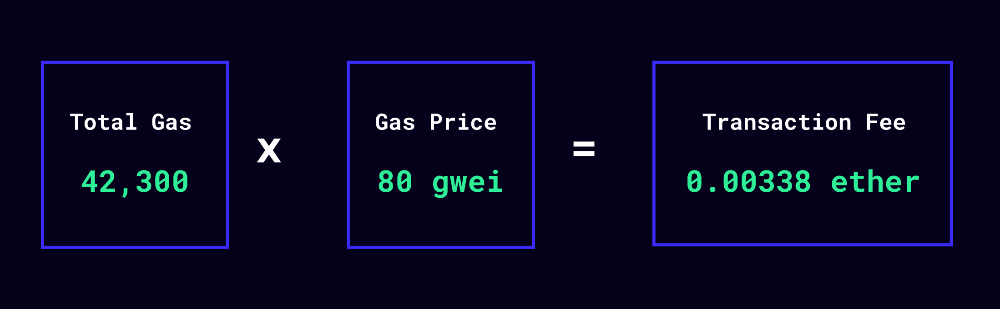

**In this Article, We will explain these topics:-**

- Reading and Writing to a State Variable
- Units in solidity
- Gas and Gas Price
- For and While Loop
- Mapping
- Array

## Reading and Writing to a State Variable

<span style="color:Orange;"> State variables: </span> Variables in programming refer to storage locations that can contain values. These values can be changed during runtime. The variable can be used at multiple places within the code and they will all refer to the value stored within it. Solidity provides two types of variable-state and memory variables. In this section, we will introduce state variables.

One of the most important aspects of Solidity contracts is state variables. It is these state variables that are permanently stored in a blockchain/Ethereum ledger by miners. Variables declared in a contract that is not within any function are called state variables. State variables store the current values of the contract. The allocated memory for a state variable is static.
- Variables whose values are permanently stored in contract storage.
- To write or update a state variable you need to send a transaction.
- You can read state variables, for free, without any transaction fee.

	

##  Units in solidity

There are two types of units in Solidity :
<span style="color:DodgerBlue;"> 1- Time Unit </span>

Time units, on the other hand, are used to measure the duration of certain events in the blockchain, such as the amount of time that must pass before a certain action is allowed to occur. 
Solidity provides several time units that can be used in your code, including:
- seconds (s).
- minutes (min).
- hours (h).
- days (days).
- weeks (weeks).

<span style="color:green;">Example 1: </span> Time unit can be used to specify a duration in the smart contract like this:

```astro
---
uint public lockPeriod = 1 week;
---
```

<span style="color:DodgerBlue;"> 2- Ether & Wei </span>

Ether units are used to represent value, such as the amount of money being transferred between accounts or the cost of a transaction. 

- The smallest unit of ether is called a wei
- Transactions are paid with ether.
- Similar to how one dollar is equal to 100 cents, one ether is equal to 1018 wei.

```astro
---
pragma solidity ^0.8.17;
contract EtherUnits {
 // 1 wei is equal to 1boolpublicisOneWei =1wei==1;
    uint public oneWei =1wei;
// 1 ether is equal to 10^18 wei
uint public oneEther =1ether;
       bool public isOneEther =1ether==1e18;
   }
---
```


> NOTE: Both Ether and Time units can be either local or global, with local units being accessible only within a specific function or contract, and global units being available throughout the entire program.

## Gas and Gas Price
How much ether do you need to pay for a transaction?

You pay gas spent * gas price amount of ether, where
- gas is a unit of computation
- gas spent is the total amount of gas used in a transaction
- gas price is how much ether you are willing to pay per gas

Transactions with higher gas price have higher priority to be included in a block.
Unspent gas will be refunded.

Gas Limit:
There are 2 upper bounds to the amount of gas you can spend
- gas limit (max amount of gas you’re willing to use for your transaction, set by you)
- block gas limit (max amount of gas allowed in a block, set by the network)


There are a couple of major limitations when it comes to running smart contracts:
- Every deployed transaction, smart contract, or execution of a smart contract, must be run on every single full node on the Ethereum blockchain to guarantee validity. This is wildly inefficient (though newer blockchains are streamlining this)!
- Because smart contracts are Turing complete, they can potentially execute forever, locking up every single node on the blockchain.
<span style="color:green;" Example: </span> Calculating Gas Costs 

For any given program, the total gas used is calculated as the sum of the gas for each operation executed by the Ethereum Virtual Machine. For example, adding two numbers in a smart contract costs 3 gas, whereas sending a transaction costs 21,000 gas.

The total cost of gas is found by taking the amount of gas used in a smart contract and multiplying it by the gas price, a value set by you, the transaction sender.


Setting a higher gas price for your transaction means it’s more likely to be confirmed on the blockchain, as the Ethereum blockchain can only confirm about 15 transactions a second. However, it also costs more Ether for the sender.
Another important value that can be set is the gas limit or the maximum amount of gas you’re willing to spend on your transaction.
By multiplying the gas price by the gas limit, you’ll get the maximum amount of Ether you’re allowing Ethereum to spend on gas fees for any particular transaction.

Learn about gas execution:
When a smart contract call is made, the call (or transaction) will attempt to use the gas provided while the program is executed.
- If the call succeeds, the unused gas will be returned to the sender.
- If the call fails because it ran out of gas, the entire transaction will revert, undoing all changes to the blockchain. None of the gas will be returned since it will all have been used up during the computation process.

A portion of gas fees from a successful transaction will be burned (or removed from the total supply) according to the new EIP-1559 spec, and the rest will be sent to the miner that added your transaction to the blockchain.


## For and While Loop

Solidity supports for, while, and do while loops.

Don’t write loops that are unbounded as this can hit the gas limit, causing your transaction to fail.

For the reason above, while and do while loops are rarely used.
<span style="color:DodgerBlue;"> For loop Syntax: </span>
```astro
---
for (initialization; test condition; iteration statement) {
       statement or block of code to be executed if the condition is True
}
---
```
<span style="color:DodgerBlue;"> While loop Syntax: </span>
```astro
---
while (condition) {
statement or block of code to be executed if the condition is True
}
---
```

<span style="color:DodgerBlue;"> do while loop Syntax: </span>
```astro
---
do 
{
   block of statements to be executed
} while (condition);

---
```

```astro
---
pragma solidity ^0.8.17;
contract Loop {
  function loop() public { 
    // for loop
    for (uint i = 0; i < 10; i++) {
      if (i == 3) {
          // Skip to next iteration with continue
                continue;
           }
           if (i == 5) {
                // Exit loop with break
                break;
            }
        }
        // while loop
        uint j;
        while (j < 10) {
            j++;
       // do while loop
          do{
               j++;
               data.push(j);
            } while(j < 5) ;
        }
     }
  }
---
```


## Mapping

You can also use dynamic tags by setting a variable to an HTML tag name or a component import:

```astro title="src/components/DynamicTags.astro" /Element|(?<!My)Component/
---
import MyComponent from './MyComponent.astro'
const Element = 'div'
const Component = MyComponent
---

<Element>Hello!</Element>
<!-- renders as <div>Hello!</div> -->
<Component />
<!-- renders as <MyComponent /> -->
```

When using dynamic tags:

- **Variable names must be capitalized.** For example, use `Element`, not `element`. Otherwise, Astro will try to render your variable name as a literal HTML tag.

- **Hydration directives are not supported.** When using [`client:*` hydration directives](/en/core-concepts/framework-components/#hydrating-interactive-components), Astro needs to know which components to bundle for production, and the dynamic tag pattern prevents this from working.

## Array

Astro supports using either `<Fragment> </Fragment>` or the shorthand `<> </>`.

Fragments can be useful to avoid wrapper elements when adding [`set:*` directives](/en/reference/directives-reference/#sethtml), as in the following example:

```astro title="src/components/SetHtml.astro" "Fragment"
---
const htmlString = '<p>Raw HTML content</p>'
---

<Fragment set:html={htmlString} />
```
