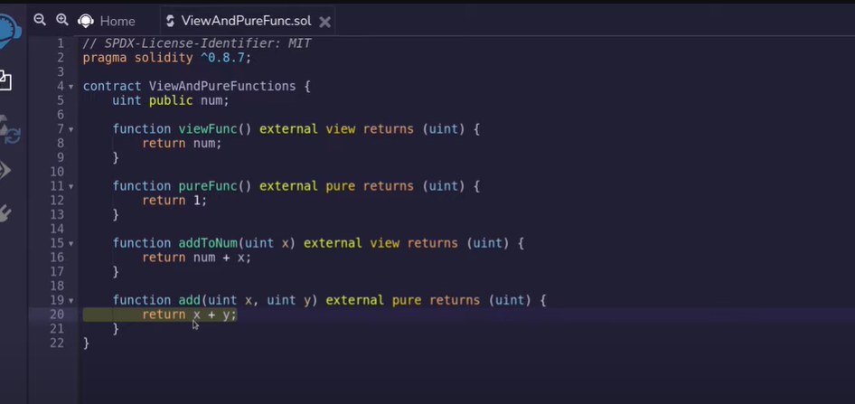

**In this Article, We will explain these topics:-**

- Variables Types.
- Function.
- View and Pure Functions.
- Visibility.
- Function Modifier

## Variables Types
  
Here we introduce you to some primitive data types available in Solidity:

- Bool
- int
- unit
- address
- Bytes32

Default values :

- <span style="color:Orange;"> bool public </span> <span style="color:DodgerBlue;"> defaultBool; </span>  <span style="color:green;">// false  </span>
- <span style="color:Orange;"> uint public </span> <span style="color:DodgerBlue;">defaultUint; </span> <span style="color:green;"> // 0 </span>
- <span style="color:Orange;"> int public </span> <span style="color:DodgerBlue;">defaultInt;</span>  <span style="color:green;">// 0 </span>


## Function

The basic syntax is shown here

```astro
---
function function-name(parameter-list) scope returns() {
   //statements
}
---

```

```astro
---
contract Function {
    // Functions can return multiple values.
    function returnMany() public pure returns (uint, bool, uint) {
        return (1, true, 2);
    }
   // Return values can be named.
    function named() public pure returns (uint x, bool b, uint y) {
        return (1, true, 2);
   }
---
```
## View and Pure Functions
There are various types of Solidity functions we’ll be covering (View and Pure Functions)

<span style="color:DarkOrange;"> View functions: </span> are read-only function, which ensures that state variables cannot be modified after calling them. By default, a get method is view function
- Do not modify state

<span style="color:DarkOrange;"> Pure functions: </span>  do not read or modify the state variables, which returns the values only using the parameters passed to the function or local variables present in it. If the statements which read the state variables, access the address or balance, access any global variable block or msg, call a function that is not pure
- Do not modify state
- Do not read state

Example:



> NOTE: State variables can be declared as public, private, or internal but not external.

## Visibility

Functions and state variables have to declare whether they are accessible by other contracts.

Functions can be declared as
- public –> any contract and account can call
- private –> only inside the contract that defines the function
- internal –> only inside contract that inherits an internal function
- external –> only other contracts and accounts can call


## Function Modifier

Function Modifiers are used to modify the behavior of a function. For example to add a prerequisite to a function.

<span style="color:DarkOrange;"> Modifiers are : </span>
- Reusable code
- Run before and/or after a function call.

<span style="color:DarkOrange;"> Modifiers can be used to: </span>
- Restrict access
- Validate inputs
- Guard against reentrancy hack
