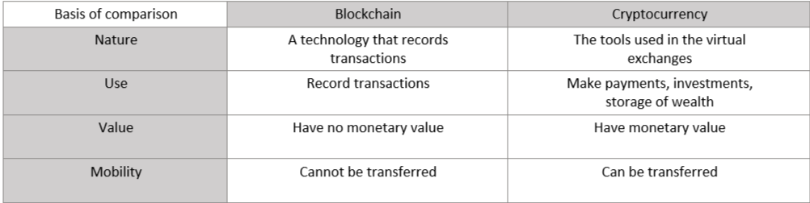

**Introduction to Blockchain Technology.** ((In this Article, We will Cover these topics)):-
- What is Blockchain? 
- Blockchain Vs Cryptocurrency.
- Blockchain Types?
- Blockchain Technologies?

## What is Blockchain?
- Blockchain is a transaction record database that is distributed, permissionless, and maintained around the world by a network of nodes.
- Blockchain has a distributed group of nodes that oversee the network.
- Blockchain uses decentralized technologies to provide a peer-to-peer, permissionless, and immutable network to store transactions.
- Some real-life examples:
	 * Bank account statements
	 * A simple record-keeping book
	 * Excel sheets tracking hospital equipment
	 * Records of sale and purchase of raw material

## Blockchain Vs Cryptocurrency.
- Blockchain is a decentralized ledger of all transactions across a peer-to-peer network
- Cryptocurrency is a medium of exchange, created and stored electronically in the blockchain
	

## Blockchain Types?
- Public Blockchain
- Private Blockchain
- Federated/consortium

Public Blockchain: 
	* A public blockchain is permissionless. Anyone can access the network and read, write, or participate without explicit authorization and permission in 
	  a public blockchain.
	* A public blockchain is decentralized and has no single network-controlled entity
	* Data on a public blockchain is protected because data cannot be changed or manipulated until it has been checked on the blockchain.
	* Well-known examples of a public blockchain are Bitcoin and Ethereum.

Private Blockchain: 
	* A private blockchain is a permissioned blockchain. Private blockchains function based on access restrictions that limit individuals who may interact 
	in the network. In these blockchains, there are one or more network management organizations, and this contributes to creating dependence on 
	transfers from third parties.
	* Only the individuals involved in a contract will have information about it in a private blockchain, while the others will not be able to access it.
	* Only authorized nodes can read and write the transaction data into a blockchain. One authorized node can be the arbitrator for any dispute.
	* Security can be implemented straightforwardly. It’s easy or computationally less expensive to add a block in a private blockchain.
	* A well-known example of a private blockchain is the Linux Foundation’s Hyperledger Fabric.
	
Federated/Consortium Blockchain: 
	* A Consortium or Federated Blockchain is a private, permissioned blockchain – as opposed to a public blockchain – where entities can only become members 	of the network by prior approval or voting.
	* This type is a group-owned system where sole autonomy is removed. Permissions are vested in a group of companies or individuals.
	* Here, more than one central entity is in charge of deciding and providing read, write, and audit access to pre-selected nodes in the blockchain. 
	Only consortium members can make, validate, and review transactions.
	* This type is suitable for use between companies that often have dealings with each other. While these are more secure, they come at the cost 
	of decentralization. However, this suits enterprise use cases and business processes.
	* A well-known example is R3’s Corda Blockchain

## Blockchain Technologies?
- Bitcoin  
- Ethereum  
- Hyperledger  
- Corda  
- Quorum 

 Bitcoin: 
	* Bitcoin is a globally known cryptocurrency and digital payment system. It was the first decentralized digital currency whose ledger is maintained 
          by blockchain openly. 
	* Bitcoin is an implementation of blockchain distributed ledger technology and the transactions in Bitcoin blockchain take place directly between users, 	  without an intermediary. 
	* Bitcoin is permissionless, meaning nobody owns or regulates Bitcoin but everybody can participate in the network. 
	* There are no physical Bitcoins, just balances stored on a public database that everyone has open access to, which is 
	* Checked by a vast amount of processing power along with all Bitcoin transactions 

 Ethereum: 
	* Ethereum is also an open-source software platform, based on Blockchain technology that enables developers to build and deploy 
	   decentralized applications. 
	* It offers a decentralized virtual machine aka Ethereum Virtual Machine (EVM) which can execute scripts using a global network of public nodes. 
	* It allows us to create and run Smart Contracts and Distributed Applications (DApps) without any downtime, fraud, control, or intervention by a 
	  third party. 
	* Ethereum is not just a framework but also a programming language running on a blockchain that lets developers create and publish 
	  distributed applications. 

 Hyperledger: 
	* Hyperledger is a multi-project, open-source blockchain platform created by Linux Foundation. 
	* It is a global collaboration, hosted by The Linux Foundation, including leaders in finance, banking, the Internet of Things, supply chains, 			  manufacturing, and technology. 
	* Hyperledger acts as an operating system for marketplaces, data-sharing networks, micro-currencies, and decentralized digital communities. 
	* It serves as a neutral home for various distributed ledger frameworks including Hyperledger Fabric, Sawtooth, and Indy, as well as tools like 		  Hyperledger Caliper and libraries like Hyperledger Ursa. 

Corda:  
	* Corda is a distributed ledger open-source platform for businesses. It is among the most sophisticated platforms to enable the implementation 
	  of enterprise blockchain applications. 
 	* It is not a blockchain and also not a native cryptocurrency. 
 	* Nodes here are arranged in an authenticated peer-to-peer network with no message broadcasting. 
 	* Corda is not stuck to any particular consensus algorithm, as one Corda network may contain multiple notaries that provide their guarantees using 
          a variety of different algorithms. 
	* Corda promises that the data is only exchanged with parties who have a ‘need to know’ information. It was designed to add transparency and confidence, 	  while preserving privacy and protection with ongoing interactions. 
