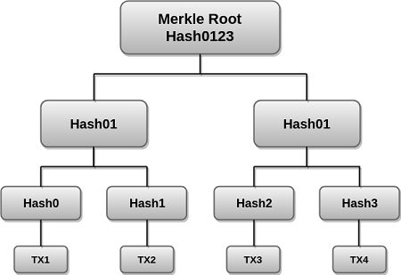
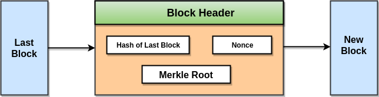
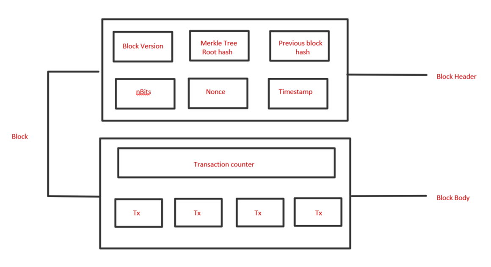

**Blockchain Ecosystem.**((In this Article, We will Cover these topics)):- 
- Merkle Tree & Hashing
- Blocks wallets & Addresses
- Cryptography & Cryptographic Algorithms
- Public & Private key

## Merkle Tree & Hashing
- Merkle Tree:
	* A Merkle tree is a data structure that uses hashing to store and verify the data.
	* In the Merkle tree, each root node contains the hash value of a data block, and non-leaf nodes contain the hash of the child nodes.
	* Merkle trees are used for effective data validation in distributed systems.
	* In a blockchain, each leaf node is the hash of a transaction in the block, and each non-leaf node is a hash of its children.
	* Merkle trees are secure because of hashing. If any data is changed, the Merkle tree structure becomes incorrect.
	* Merkle trees are small in size, making it much easier to maintain and verify the data in the tree.

- Merkle Tree in Blockchain:
	* Merkle trees are used at the base layer of the blockchains to store and verify transaction data.
	* Merkle trees provide data security and integrity by using hash functions.
	* In the case of blockchains, without Merkle trees, the blockchain will become very hard to manage 
	  and use.

		
The above example is the most common and simple form of a Merkle tree, i.e., Binary Merkle Tree. There are four transactions in a block: TX1, TX2, TX3, and TX4. Here you can see, there is a top hash which is the hash of the entire tree, known as the Root Hash, or the Merkle Root. Each of these is repeatedly hashed, and stored in each leaf node, resulting in Hash 0, 1, 2, and 3. Consecutive pairs of leaf nodes are then summarized in a parent node by hashing Hash0 and Hash1, resulting in Hash01, and separately hashing Hash2 and Hash3, resulting in Hash23. The two hashes (Hash01 and Hash23) are then hashed again to produce the Root Hash or the Merkle Root.

		
Merkle Root is stored in the block header. The block header is part of the Bitcoin block which gets hash in the process of mining. It contains the hash of the last block, a Nonce, and the Root Hash of all the transactions in the current block in a Merkle Tree. So having the Merkle root in the block header makes the transaction tamper-proof. As this Root Hash includes the hashes of all the transactions within the block, these transactions may result in saving disk space.

- Hashing:
	* Hashing is the process of having an input item of any length converted into an 
	output item of a fixed length.
	* Transactions of different lengths are run through a given hashing algorithm, 
	and all give an output of a fixed length, called a hash.
	* The hash size will depend on the hash function used, but the output using 
	a particular hashing algorithm will be of a specific size.
	* Cryptographic hash functions are one of the most important techniques in the field of cryptography and are used to accomplish many safety 
	goals such as authentication, digital signatures, generation of pseudo numbers, digital steganography, digital time-stamping, etc.
	* Bitcoin uses a cryptographic hashing algorithm- Secure Hashing Algorithm 256, 
	often known as SHA-256.

## Blocks wallets & Addresses
- Blocks

	* A block is the fundamental unit of a Blockchain
	* Every block contains a hash of all the previous blocks.
	* Blocks use Merkle tree to store the hash of all the transactions to create 
	 the hash of block.
 A block is divided into:
	 - Block header 
	 - Block body 
Block header is divided into six components:
	* Version number
	* Previous block hash
	* Merkle tree root hash
	* nbits
	* Nonce
	* Timestamp

	Block body contains all the transactions:	
	

- Wallet:
	* A Blockchain wallet is a software program that enables users to buy, sell, 
	and monitor the balance of their digital assets and record the transactions done 
	using the wallet address.
	* A wallet stores private and public keys for a user. As the name suggests, 
	the public key is shared and works as the address while the private key is kept private.
	* Public and private keys are used to encrypt and decrypt transactions so only 
	the intended recipient can know the transaction data.
	* A Blockchain wallet offers all the features available for safe and 
	secure transactions and exchanges of funds between various parties.

	There are three types of cryptocurrency wallets :
	* Software Wallets:   like Metamask which runs on a machine.
	* Hardware Wallets:   are storage devices on 
	which users can store their keys.
	* Paper Wallets:  are just writing down your 
	public and private key on a paper and keeping it someplace safe.

## Cryptography & Cryptographic Algorithms

## Public & Private key
