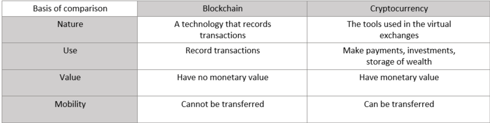

**Blockchain Ecosystem**((In this Article, We will Cover these topics)):- 
- Merkle Tree & Hashing
- Blocks wallets & Addresses
- Cryptography & Cryptographic Algorithms
- Public & Private key

## Merkle Tree & Hashing
- Merkle Tree:
	* A Merkle tree is a data structure that uses hashing to store and verify the data.
	* In the Merkle tree, each root node contains the hash value of a data block, and non-leaf nodes contain the hash of the child nodes.
	* Merkle trees are used for effective data validation in distributed systems.
	* In a blockchain, each leaf node is the hash of a transaction in the block, and each non-leaf node is a hash of its children.
	* Merkle trees are secure because of hashing. If any data is changed, the Merkle tree structure becomes incorrect.
	* Merkle trees are small in size, making it much easier to maintain and verify the data in the tree.

- Merkle Tree in Blockchain:
	* Merkle trees are used at the base layer of the blockchains to store and verify transaction data.
	* Merkle trees provide data security and integrity by using hash functions.
	* In the case of blockchains, without Merkle trees, the blockchain will become very hard to manage 
	  and use.
	* The node would need to compare each entry line by line.
	* Any discrepancy between the ledgers compromises the security of the network.
	* Every verification request would require large packets of information to be sent over the network.
	* A lot of processing power is consumed to compare the ledgers to ensure that there have been 
          no changes.

## Blocks wallets & Addresses
- Blockchain is a decentralized ledger of all transactions across a peer-to-peer network
- Cryptocurrency is a medium of exchange, created and stored electronically in the blockchain
	

## Cryptography & Cryptographic Algorithms

## Public & Private key
